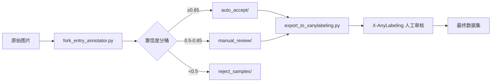

# YOLO OBB 入叉面半自动标注系统 - 实现总结

## 完成概述

实现了一套完整的托盘/货架入叉面 OBB 半自动标注工具链，可将原始图片转换为 X-AnyLabeling 可导入的预标注数据集。

---

## 实现文件

### 核心模块

| 文件 | 说明 |
|------|------|
| [fork_entry_annotator.py](file:///c:/win_ws/ultralytics/tools/fork_entry_annotator.py) | 核心标注器：YOLO-OBB 预标 + SAM3 质检 + 入叉面定位 |
| [export_to_xanylabeling.py](file:///c:/win_ws/ultralytics/tools/export_to_xanylabeling.py) | 导出工具：YOLO OBB / JSON 格式 |
| [quality_checker.py](file:///c:/win_ws/ultralytics/tools/quality_checker.py) | 独立质检模块 |

### 配置文件

| 文件 | 说明 |
|------|------|
| [annotation_rules.yaml](file:///c:/win_ws/ultralytics/tools/annotation_rules.yaml) | 标注规则配置 |
| [fork_entry.yaml](file:///c:/win_ws/ultralytics/datasets/fork_entry/fork_entry.yaml) | 数据集配置 |

### 文档

| 文件 | 说明 |
|------|------|
| [add_new_type.md](file:///c:/win_ws/ultralytics/tools/workflows/add_new_type.md) | 新类型扩展工作流 |

---

## 核心工作流程



---

## 验证结果

### 语法检查 ✅

```
python -m py_compile tools/fork_entry_annotator.py
python -m py_compile tools/export_to_xanylabeling.py
python -m py_compile tools/quality_checker.py
```

### 单元测试 ✅

| 测试项 | 结果 |
|--------|------|
| mask → OBB 转换 | ✓ 通过 |
| YOLO OBB 格式输出 | ✓ 通过 |
| 叉孔检测逻辑 | ✓ 检测到 2 个矩形孔洞 |
| X-AnyLabeling JSON | ✓ 通过 |
| 配置文件加载 | ✓ 通过 |

---

## 快速开始

### 1. 批量预标注

```bash
# 使用已有 OBB 模型
python tools/fork_entry_annotator.py \
    --images datasets/fork_entry/images/raw \
    --output datasets/fork_entry/labels/pre_annotations \
    --obb-model path/to/your_obb_model.pt

# 无 OBB 模型 (仅 SAM3)
python tools/fork_entry_annotator.py \
    --images datasets/fork_entry/images/raw \
    --output datasets/fork_entry/labels/pre_annotations
```

### 2. 导出到 X-AnyLabeling

```bash
python tools/export_to_xanylabeling.py \
    --images datasets/fork_entry/images/raw \
    --labels datasets/fork_entry/labels/pre_annotations/auto_accept \
    --output datasets/fork_entry/export/x_anylabeling
```

### 3. 人工审核

1. 安装 X-AnyLabeling: `pip install x-anylabeling`
2. 打开导出目录
3. 选择 YOLO-OBB 格式导入
4. 审核/修正标注
5. 保存

### 4. 训练 OBB 模型

```python
from ultralytics import YOLO

model = YOLO("yolo11n-obb.pt")
model.train(
    data="datasets/fork_entry/fork_entry.yaml",
    epochs=100,
    imgsz=640
)
```

---

## 入叉面标注规则

> [!IMPORTANT]
> 此规则需人机一致执行

| 规则 | 说明 |
|------|------|
| **标注对象** | 只框入叉面 (含两个叉孔的平面) |
| **遮挡处理** | 按平面外接矩形补全 |
| **长边方向** | 沿水平边对齐 |
| **角度范围** | [0°, 90°) |
| **叉孔特征** | 框内需可见叉孔/凹槽 |

---

## 目录结构

```
c:\win_ws\ultralytics\
├── datasets/
│   └── fork_entry/
│       ├── images/
│       │   ├── raw/              # 原始图片
│       │   └── processed/
│       ├── labels/
│       │   └── pre_annotations/  # 预标注输出
│       │       ├── auto_accept/
│       │       ├── manual_review/
│       │       └── reject_samples/
│       ├── export/
│       │   └── x_anylabeling/    # X-AnyLabeling 导入
│       └── fork_entry.yaml       # 数据集配置
│
└── tools/
    ├── __init__.py
    ├── fork_entry_annotator.py   # 核心标注器
    ├── export_to_xanylabeling.py # 导出工具
    ├── quality_checker.py        # 质检模块
    ├── annotation_rules.yaml     # 标注规则
    └── workflows/
        └── add_new_type.md       # 扩展指南
```

---

## 扩展新类型

详见 [add_new_type.md](file:///c:/win_ws/ultralytics/tools/workflows/add_new_type.md)

简要流程:
1. 收集 20-50 张新类型图片
2. 人工标注 10-20 张
3. 训练初始模型
4. 自动预标注剩余图片
5. 人工审核
6. 增量训练
